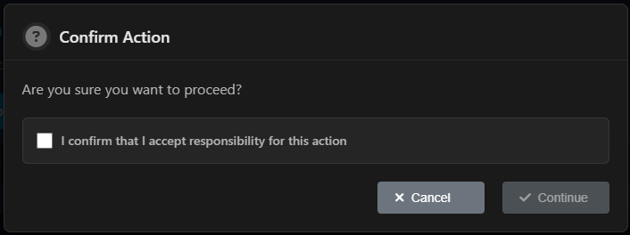
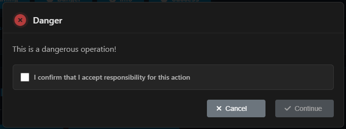
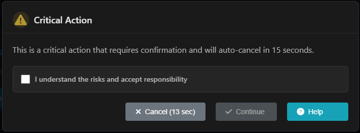
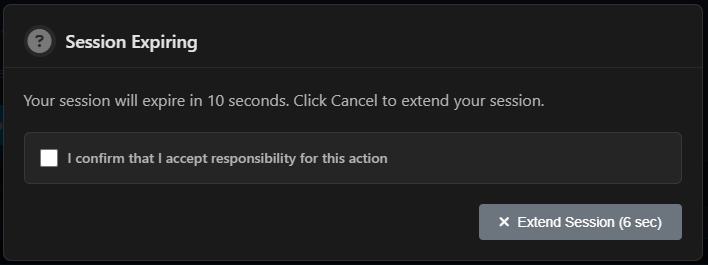

# async-modal

A Promise-based modal system that returns user selection, with support for confirmation checkboxes, auto-dismiss timeouts, and customizable buttons.

## Screenshots









## Features

- ✅ Promise-based API - Use async/await for clean code
- ✅ Multiple button types - Cancel, Continue, Settings, Help, Danger
- ✅ Confirmation checkbox - Require user confirmation before proceeding
- ✅ Auto-dismiss timeout - Automatically close modal after specified time
- ✅ Customizable icons - Warning, danger, info, success, question
- ✅ Sound notifications - Optional sound alerts
- ✅ Responsive design - Works on mobile and desktop
- ✅ Accessible - ARIA labels and keyboard navigation support
- ✅ Multiple module systems - ES modules, CommonJS, and global support
- ✅ XSS protection - HTML escaping for user input
- ✅ Internationalization (i18n) - Built-in support for 13+ languages
- ✅ Dark theme support - Automatic dark mode detection and manual theme control

## Installation

Install using yarn:

```bash
yarn add async-modal
```

Or using npm:

```bash
npm install async-modal
```

## Quick Start

### Basic Usage

```html
<!DOCTYPE html>
<html>
<head>
  <!-- CSS is automatically loaded, manual link is optional -->
  <!-- <link rel="stylesheet" href="node_modules/async-modal/src/async-modal.css"> -->
</head>
<body>
  <script src="node_modules/async-modal/src/asyncModal.js"></script>
  <script>
    async function showModal() {
      const result = await window.asyncModal.show({
        title: 'Confirm Action',
        message: 'Are you sure you want to proceed?',
        showCancel: true,
        showContinue: true
      });
      
      if (result === 'continue') {
        console.log('User clicked Continue');
      } else {
        console.log('User clicked Cancel');
      }
    }
    
    showModal();
  </script>
</body>
</html>
```

### ES Module Usage

```javascript
import AsyncModal from 'async-modal';
// CSS is automatically loaded, manual import is optional
// import 'async-modal/src/async-modal.css';

const modal = new AsyncModal();

const result = await modal.show({
  title: 'Delete Item',
  message: 'This action cannot be undone.',
  showCancel: true,
  showContinue: true,
  icon: 'danger'
});
```

### CommonJS Usage

```javascript
const AsyncModal = require('async-modal');
// CSS is automatically loaded, manual import is optional
// require('async-modal/src/async-modal.css');

const modal = new AsyncModal();

const result = await modal.show({
  title: 'Save Changes',
  message: 'Do you want to save your changes?',
  showCancel: true,
  showContinue: true
});
```

## API Reference

### `AsyncModal` Class

#### Constructor

```javascript
const modal = new AsyncModal(options);
```

**Parameters:**

- `options` (Object, optional) - Configuration options
  - `language` (string, default: `'en'`) - Default language code
  - `localePath` (string, default: `'./locales'`) - Path to locale files
  - `soundPath` (string) - Default sound file path
  - `theme` (string, default: `'light'`) - Global theme: `'dark'`, `'light'`, or `'auto'` (auto-detects system preference)
  - `timeout` (number, optional) - Global default timeout in seconds for all modals (0 or undefined to disable)

**Example:**

```javascript
// Default (English, light theme)
const modal = new AsyncModal();

// With Turkish as default language
const modal = new AsyncModal({ language: 'tr' });

// With custom locale path and theme
const modal = new AsyncModal({ 
  language: 'es',
  localePath: './custom-locales',
  theme: 'dark' // or 'light' or 'auto'
});

// With global timeout
const modal = new AsyncModal({ 
  timeout: 30 // All modals will have 30 second timeout by default
});
```

#### Methods

##### `show(options)`

Shows a modal and returns a Promise that resolves with the user's selection.

**Parameters:**

- `options` (Object) - Configuration options
  - `title` (string, default: `'Confirmation Required'`) - Modal title
  - `message` (string, default: `'Are you sure you want to proceed?'`) - Modal message
  - `showCancel` (boolean, default: `true`) - Show cancel button
  - `showContinue` (boolean, default: `true`) - Show continue button
  - `showSettings` (boolean, default: `false`) - Show settings button
  - `showHelp` (boolean, default: `false`) - Show help button
  - `showDanger` (boolean, default: `false`) - Show danger button
  - `disabled` (boolean, default: `false`) - Disable all buttons initially
  - `requireConfirmation` (boolean, default: `true`) - Require confirmation checkbox
  - `confirmationText` (string, default: `'I confirm that I accept responsibility for this action'`) - Confirmation text
  - `icon` (string, default: `'question'`) - Icon type: `'warning'`, `'danger'`, `'info'`, `'success'`, `'question'`
  - `confirmButtonText` (string, default: `'Continue'`) - Confirm button text
  - `cancelButtonText` (string, default: `'Cancel'`) - Cancel button text
  - `playSound` (boolean, default: `false`) - Play notification sound
  - `timeout` (number, optional) - Timeout duration in seconds (0 or undefined to disable, overrides global timeout)
  - `autoDismissTimeout` (boolean, deprecated) - [DEPRECATED] Use `timeout` instead
  - `autoDismissTimeoutSeconds` (number, deprecated) - [DEPRECATED] Use `timeout` instead
  - `soundPath` (string) - Custom sound file path
  - `language` (string) - Language code (overrides global language for this modal - highest priority)
  - `theme` (string) - Theme for this modal: `'dark'`, `'light'`, or `'auto'` (overrides global theme setting)
  - `darkTheme` (boolean, deprecated) - [DEPRECATED] Use `theme` instead

**Returns:** `Promise<string>` - Resolves with: `'continue'`, `'cancel'`, `'settings'`, `'help'`, or `'danger'`

**Example:**

```javascript
const result = await modal.show({
  title: 'Delete Account',
  message: 'This will permanently delete your account. This action cannot be undone.',
  showCancel: true,
  showContinue: true,
  requireConfirmation: true,
  confirmationText: 'I understand this action is irreversible',
  icon: 'danger',
  timeout: 30 // 30 seconds timeout
});
```

##### `showConfirmation(messageOrOptions)`

Shows a simple confirmation modal.

**Parameters:**

- `messageOrOptions` (string|Object) - Confirmation message (string) or options object
  - `message` (string) - Confirmation message (uses localized default if not provided)
  - `language` (string) - Language code (overrides global language for this modal)

**Returns:** `Promise<string>`

**Example:**

```javascript
// With string message
const result = await modal.showConfirmation('Do you want to save your changes?');

// With options object
const result = await modal.showConfirmation({ 
  message: 'Custom message',
  language: 'tr' // Turkish for this modal
});
```

##### `showConfirmationWithResponsibility(message, confirmationText, options)`

Shows a modal requiring responsibility confirmation.

**Parameters:**

- `message` (string, optional) - Modal message (uses localized default if not provided)
- `confirmationText` (string, optional) - Confirmation text (uses localized default if not provided)
- `options` (Object, optional) - Additional options
  - `language` (string) - Language code (overrides global language for this modal)

**Returns:** `Promise<string>`

**Example:**

```javascript
const result = await modal.showConfirmationWithResponsibility(
  'This action may have serious consequences.',
  'I accept full responsibility for this action',
  { language: 'fr' } // French for this modal
);
```

##### `showDangerousAction(messageOrOptions)`

Shows a modal for dangerous actions.

**Parameters:**

- `messageOrOptions` (string|Object) - Warning message (string) or options object
  - `message` (string) - Warning message (uses localized default if not provided)
  - `language` (string) - Language code (overrides global language for this modal)

**Returns:** `Promise<string>`

**Example:**

```javascript
// With string message
const result = await modal.showDangerousAction(
  'This will delete all data. Are you absolutely sure?'
);

// With options object
const result = await modal.showDangerousAction({ 
  message: 'Custom danger message',
  language: 'de' // German for this modal
});
```

##### `showWorkingTimeViolation(options)`

Shows a modal for working time violations.

**Parameters:**

- `options` (Object, optional) - Configuration options
  - `language` (string) - Language code (overrides global language for this modal)
  - Other standard modal options

**Returns:** `Promise<string>`

**Example:**

```javascript
const result = await modal.showWorkingTimeViolation({
  message: 'You are outside working hours. Proceed anyway?',
  language: 'es' // Spanish for this modal
});
```

##### `setSoundPath(path)`

Sets the default sound file path.

**Parameters:**

- `path` (string) - Path to sound file

**Example:**

```javascript
modal.setSoundPath('./custom-sound.wav');
```

##### `setLanguage(lang)`

Sets the current language for the modal. Supported languages: `en`, `tr`, `es`, `fr`, `de`, `it`, `pt`, `ru`, `ja`, `zh`, `ko`, `ar`, `hi`.

**Parameters:**

- `lang` (string) - Language code

**Returns:** `Promise<void>`

**Example:**

```javascript
await modal.setLanguage('tr'); // Turkish
await modal.setLanguage('es'); // Spanish
await modal.setLanguage('fr'); // French
```

##### `setTheme(theme)`

Sets the global theme preference.

**Parameters:**

- `theme` (string) - Theme value: `'dark'`, `'light'`, or `'auto'`

**Example:**

```javascript
modal.setTheme('dark');  // Enable dark theme
modal.setTheme('light'); // Use light theme
modal.setTheme('auto');  // Auto-detect system preference
```

##### `getTheme()`

Gets the current global theme preference.

**Returns:** `string` - Current theme: `'dark'`, `'light'`, or `'auto'`

**Example:**

```javascript
const theme = modal.getTheme();
console.log('Current theme:', theme);
```

##### `setTimeout(seconds)`

Sets the global default timeout for all modals.

**Parameters:**

- `seconds` (number) - Timeout duration in seconds (0 or null to disable)

**Example:**

```javascript
modal.setTimeout(30); // Set 30 second timeout for all modals
modal.setTimeout(0);  // Disable timeout
```

##### `close(action)`

Closes the current modal programmatically.

**Parameters:**

- `action` (string) - Action to return: `'continue'`, `'cancel'`, `'settings'`, `'help'`, or `'danger'`

**Example:**

```javascript
modal.close('cancel');
```

## Examples

### Basic Confirmation

```javascript
const result = await modal.show({
  title: 'Save Changes',
  message: 'Do you want to save your changes before leaving?',
  showCancel: true,
  showContinue: true
});

if (result === 'continue') {
  // Save changes
  saveChanges();
}
```

### With Confirmation Checkbox

```javascript
const result = await modal.show({
  title: 'Delete Item',
  message: 'This will permanently delete the item.',
  requireConfirmation: true,
  confirmationText: 'I understand this action cannot be undone',
  icon: 'danger'
});
```

### With Auto-Dismiss Timeout

```javascript
const result = await modal.show({
  title: 'Session Expiring',
  message: 'Your session will expire in 30 seconds.',
  timeout: 30, // 30 seconds timeout
  showCancel: true
});

// If timeout expires, result will be 'cancel'
```

### Multiple Buttons

```javascript
const result = await modal.show({
  title: 'Action Required',
  message: 'Choose an action:',
  showCancel: true,
  showContinue: true,
  showSettings: true,
  showHelp: true,
  showDanger: true
});

switch (result) {
  case 'continue':
    // Handle continue
    break;
  case 'settings':
    // Open settings
    break;
  case 'help':
    // Show help
    break;
  case 'danger':
    // Handle danger action
    break;
  case 'cancel':
    // Handle cancel
    break;
}
```

### With Sound Notification

```javascript
const result = await modal.show({
  title: 'Important Alert',
  message: 'Please review this important information.',
  playSound: true,
  soundPath: './custom-notification.wav' // Optional custom path
});
```

### Internationalization (i18n)

async-modal includes built-in support for 13+ languages. All default messages, button texts, and titles are automatically localized.

**Supported Languages:**
- English (`en`) - Default
- Turkish (`tr`)
- Spanish (`es`)
- French (`fr`)
- German (`de`)
- Italian (`it`)
- Portuguese (`pt`)
- Russian (`ru`)
- Japanese (`ja`)
- Chinese (`zh`)
- Korean (`ko`)
- Arabic (`ar`)
- Hindi (`hi`)

**Language Priority (from highest to lowest):**

1. **Function parameter** (`options.language`) - Highest priority, overrides everything
2. **Global language** (set via `setLanguage()` or constructor)
3. **Default** (`'en'` - English)

**Set Language in Constructor:**

```javascript
// Set default language when creating instance
const modal = new AsyncModal({ language: 'tr' }); // Turkish
```

**Set Language Globally:**

```javascript
// Set language for all modals
await modal.setLanguage('tr'); // Turkish

// Now all modals will use Turkish translations (unless overridden)
const result = await modal.show({
  // title and message will be in Turkish if not specified
});
```

**Set Language Per Modal (Highest Priority):**

```javascript
// Use specific language for one modal - overrides global language
const result = await modal.show({
  language: 'es', // Spanish - this modal will be in Spanish
  // Other options...
});

// Global language remains unchanged
const result2 = await modal.show({
  // This modal will use the global language (Turkish from setLanguage above)
});
```

**Using Localized Helper Methods:**

```javascript
// Set language first
await modal.setLanguage('fr'); // French

// Helper methods automatically use localized strings
const result = await modal.showConfirmation(); // Uses French "Confirmation Requise"
const result2 = await modal.showDangerousAction(); // Uses French "Action Dangereuse"
const result3 = await modal.showWorkingTimeViolation(); // Uses French messages

// Override language for specific helper method calls
const result4 = await modal.showConfirmation({ language: 'es' }); // Spanish for this modal only
const result5 = await modal.showDangerousAction({ language: 'de' }); // German for this modal only
```

**Available Localized Strings:**

All default texts are automatically localized:
- Button labels (Continue, Cancel, Settings, Help)
- Default titles (Confirmation Required, Dangerous Action, etc.)
- Default messages (working time violations, delete confirmations, etc.)
- Confirmation checkbox text
- Timeout labels (seconds, expired)

**Custom Messages with Localization:**

```javascript
// You can still use custom messages, but buttons will be localized
const result = await modal.show({
  language: 'de', // German
  title: 'Custom Title', // Your custom title
  message: 'Custom Message', // Your custom message
  // Buttons will be in German: "Fortfahren", "Abbrechen", etc.
});
```

## Dark Theme

The modal supports dark theme with automatic system preference detection. You can control the theme globally or per modal.

### Theme Options

The theme can be set to:
- `'light'` - Always use light theme (default)
- `'dark'` - Always use dark theme
- `'auto'` - Automatically detect system preference

### Automatic Dark Theme Detection

Use `'auto'` theme to automatically detect your system's color scheme preference:

```javascript
// Automatically uses dark theme if system preference is dark
const modal = new AsyncModal({ theme: 'auto' });
const result = await modal.show({
  title: 'Confirm Action',
  message: 'This modal will use dark theme if your system is set to dark mode'
});
```

### Manual Theme Control

You can manually control the theme:

```javascript
// Set dark theme globally
const modal = new AsyncModal({ theme: 'dark' });
modal.setTheme('dark');  // Or change it later

// Use dark theme for a specific modal only
const result = await modal.show({
  title: 'Dark Modal',
  message: 'This modal uses dark theme',
  theme: 'dark'  // Overrides global setting
});

// Use light theme for a specific modal
const result2 = await modal.show({
  title: 'Light Modal',
  message: 'This modal uses light theme',
  theme: 'light'  // Overrides global setting
});

// Use auto theme for a specific modal
const result3 = await modal.show({
  title: 'Auto Modal',
  message: 'This modal uses system preference',
  theme: 'auto'  // Overrides global setting
});
```

### Theme Priority

1. **Function parameter** (`options.theme` in `show()` method) - Highest priority
2. **Global setting** (set via `setTheme()` or constructor) - Medium priority
3. **Default** (`'light'`) - Default fallback

## CSS Auto-Loading

The CSS file is automatically loaded when you import or require the JavaScript module. You don't need to manually import the CSS file in most cases.

**Manual CSS import is optional:**

```javascript
// CSS is automatically loaded, this is optional
import 'async-modal/src/async-modal.css';
```

The auto-loading works in:
- Browser script tags
- ES modules
- CommonJS
- NPM package installations

## Styling

The modal comes with default styles. You can customize it by overriding CSS classes:

- `.async-modal-overlay` - Modal overlay/backdrop
- `.async-modal` - Modal container
- `.async-modal-header` - Modal header
- `.async-modal-title` - Modal title
- `.async-modal-body` - Modal body
- `.async-modal-btn` - Button base styles
- `.async-modal-btn-cancel` - Cancel button
- `.async-modal-btn-continue` - Continue button
- `.async-modal-btn-settings` - Settings button
- `.async-modal-btn-help` - Help button
- `.async-modal-btn-danger` - Danger button

## Requirements

- Modern browser with ES6+ support

## Browser Support

- Chrome (latest)
- Firefox (latest)
- Safari (latest)
- Edge (latest)

## License

MIT

## Contributing

Contributions are welcome! Please feel free to submit a Pull Request.

## Changelog

### 1.0.3

- **Breaking Change:** Theme API updated: `darkTheme: boolean` → `theme: 'dark' | 'light' | 'auto'`
  - `setDarkTheme(enabled)` → `setTheme(theme)`
  - `getDarkTheme()` → `getTheme()`
  - Default theme is now `'light'` (was auto-detect)
- **Breaking Change:** Timeout API simplified: `autoDismissTimeout` and `autoDismissTimeoutSeconds` → `timeout: number`
  - Added global `setTimeout(seconds)` method
  - `timeout: 30` is cleaner than `autoDismissTimeout: true, autoDismissTimeoutSeconds: 30`
- **Feature:** CSS auto-loading - CSS is automatically injected when JavaScript is imported
- **Improvement:** Better locale file path detection for NPM package installations
- **Backward Compatibility:** Old `darkTheme` and `autoDismissTimeout` parameters still work but are deprecated

### 1.0.0

- Initial release
- Promise-based API
- Multiple button types
- Confirmation checkbox support
- Auto-dismiss timeout
- Sound notifications
- Responsive design
- Accessibility features
- Internationalization (i18n) support for 13+ languages

